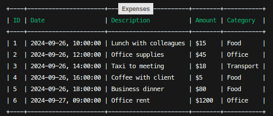

<h1 align="center">Expense tracker</h1>
<h3 align="center">Expense tracker application to manage your finances in CLI.</h3>
<div align="center" ><strong><a href="https://roadmap.sh/projects/expense-tracker">Inspiration</a></strong></div>

</br>

## Features:

- Users can **add** an expense with a description and amount
- Users can **update** an expense.
- Users can **delete** an expense.
- Users can **view all** expenses.
- Users can **view a summary** of all expenses.
- Users can **view a summary** of expenses for a specific month (of current year).
- Users can **add** expense categories and allow users to **filter** by category.
- Users can **set** a budget for each month and app shows a warning when the user exceeds the budget.
- Users can **export** expenses to **CSV** file.

## Commands Example:

#### Add expenses

```bash
./index.php add --description "Lunch" --amount 20 --category "Food"
```

#### List expenses

```bash
# List All Expenses:

./index.php all

# Or list by category:

./index.php all --category "Food"
```

- Listed Expenses



#### Delete expenses

```bash
./index.php delete --id 1
```

#### Summary of expenses

```bash
# Summary of the expenses

./index.php summary 

# Summary of the selected month

./index.php summary --month 9
```

#### Set budget for month

```bash
./index.php budget --limit 1000 --month 3
```
#### Export budget to CSV

```bash
./index.php export
```


## Instalation

1. Clone the repository to your local machine:

```bash
  git clone https://github.com/F4eNn/Expense-tracker-CLI.git
```
2. Install dependencies:

```bash
  composer install
```

